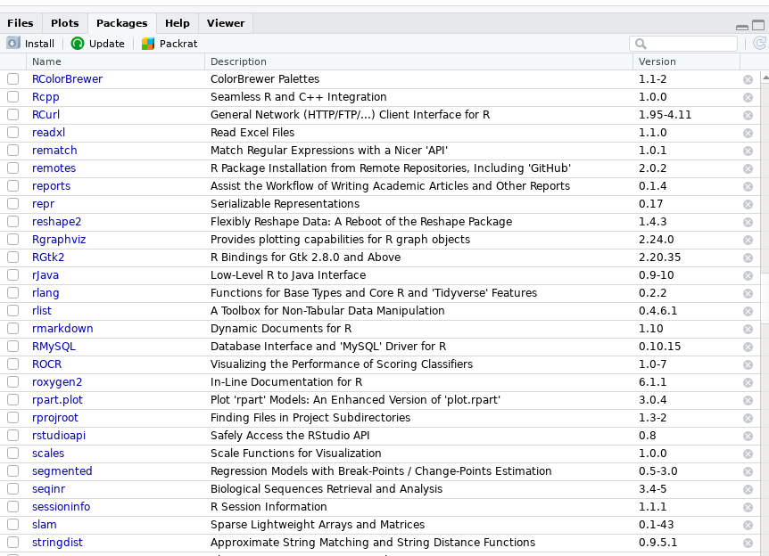
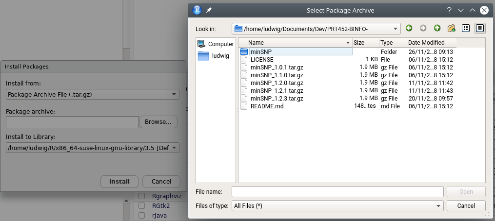

```{r setup, include = FALSE}
knitr::opts_chunk$set(
  collapse = TRUE,
  comment = "#>"
)
```

`minSNP` is a software package for interrogating single nucleotide polymorphisms (SNPs). It is based on previous work by Phil Giffard^[G. A. Robertson, V. Thiruvenkataswamy, H. Shilling, E. P. Price, F. Huygens, F. A. Henskens, and P. M. Giffard, 'Identification and Interrogation of Highly Informative Single Nucleotide Polymorphism Sets Defined by Bacterial Multilocus Sequence Typing Databases', J Med Microbiol, 53 (2004), 35-45.]. The package also combine SNP-based genotyping with HRMA based on work by Steven Tong^[R. A. Lilliebridge, S. Y. Tong, P. M. Giffard, and D. C. Holt, 'The Utility of High-Resolution Melting Analysis of Snp Nucleated Pcr Amplicons--an Mlst Based Staphylococcus aureus Typing Scheme', PLoS One, 6 (2011), e19749.]. The mentioned program converts known alleles into predicted HRMA-resolved alleles on the basis of predicted melting point, and converts multilocus sequence information into predicted multilocus HRMA genotypes. This package is based on the previous program in stata and is rewritten to be as generic as possible and can be applied to different bacterial species. 

## Prerequisites & installation

R is needed to run the software package. [RStudio](https://www.rstudio.com/products/rstudio/download/) provides a good graphics user interface and is highly recommended.

The package has the following dependencies which need to be installed manually:

- `rlist`
- `seqinr`

This can be done either through the command line in R
```r
install.packages(c("rlist", "seqinr"))
```
or in RStudio, tick the relevant boxes


The package can be downloaded from here: <https://github.com/ludwigHoon/PRT452-BINFO-/releases> 

The installation process in RStudio is similar to earlier and one needs only to select the correct tar.gz file. 


Alternatively one can install using command line
```r
install.packages(“minSNP_1.2.3.tar.gz”, repos = NULL, type = “source”)
```

Once that is done, verify that the package has been installed successfully by running 
```r
library(minSNP)
```

## minSNP analysis

### Prepocessing
Step 1. Activate the software
```{r}
library(minSNP)
```

Step 2. Read the fasta file
Some sample data set has been included together in the package. The data used here can be accessed with
```r 
system.file("extdata", "Chlamydia_1.txt", package="minSNP")
```
When doing actual analysis, one needs only to replace the last line with the actual path of the file. 

```{r}
chlamydia<-readFasta(system.file("extdata", "Chlamydia_1.txt", package="minSNP"))
```
The data used here contained some modifications to demonstrate what some of the functions can do. 

The file needs to be:

        1. Multiple sequences in FASTA format in a single file (you cannot load multiple files) 
        2. Txt format
        3. Non-standard bases are allowed. 
        4. Indels are allowed, denoted by dashes. 
        5. Aligned, so that all positions in the sequences are orthologous. This implies that all the sequences have to be the same length – or, to be exact, if they are not, then the truncated sequences have to be lengthened with dashes, and/or indels have to be indicated.  

Since, concatenated FASTA file obtained from <https://pubmlst.org/> can either be aligned (limited to 200 STs) or not aligned. Regardless, the following steps will further process the sequences and check for anomalies that may affect analysis. 

Step 3. Process the data to remove sequences which has different length. These sequences will be dropped from analysis
```{r}
processedChlamydia<-processAllele(chlamydia)
```
Comment: The output shows the alleles that have been excluded from analysis. 

Step 4. Check for invalid characters in the sequences
```{r}
#Indels considered as nonstandard character
exc_positions<-flagPosition(processedChlamydia)

#Indels not considered as nonstandard character
exc_positions<-flagPosition(processedChlamydia, dashIgnore=FALSE)
```

Comment: This step check the sequences for invalid characters, and add the position into a variable. Alleles at these positions are not dropped. The variable will be used in later stages. Adding 
```r
dashIgnore=FALSE
``` will causes indels to not be considered as invalid character and can be included in analysis as informative.

### Percent Mode
This mode can be used to do 2 types of analysis:  
1. Finding SNPs diagnostic for a particular sequence in the alignment
2. Finding SNPs diagnostic for a group of variants

#### 1. Finding SNPs diagnostic for a particular sequence in the alignment.  

The function `branch.percent` takes 5 arguments, where the first argument is a processed allele and the second argument is the name of the allele to be compared, the third being how many positions are joined together, excluded are the positions that are excluded from calculation and numRes is the number of result to obtain.
```{r}
result=branch.percent(processedChlamydia, "L3_404", 3, excluded=exc_positions, numRes=2)
```

This is asking the program to find two sets of SNPs each of size of three SNPs, diagnostic for sequence L3_404 in the alignment. The result is stored in variable result (any arbitary name can be used). If you want to see the result, just type “result” (without the inverted commas) and hit return. 

```{r}
result
```

The result shows that just a single position – position 522 (result set 1, position 1) – unambiguously identifies sequence L3_404. In result set 1, the first two SNPs (positions 522 and 1) is still 100%, because you can’t get higher than the 100% that you get from position 522 by itself. A minor issue is that the output in the two lines above does not make it absolutely clear it is looking at the resolving power of two SNPs – the two in the double square brackets means “the first two SNPs/positions in the set”, not “the second SNP in the set by itself”. 

That second two SNPs are alignment positions 1 and 2 is a consequence of the fact that position 522 gives 100%. This the maximum possible resolving power than that, so all other positions in the alignment give the same performance of adding zero extra resolving power, so the program picked the first two it came to – positions 1 and 2. 

The second result below show that position 768 by itself also unambiguously identifies the target sequence. Similar to earlier, positions 1 and 2 is a consequence of the fact that position 768 gives 100%. 

`percent.residual` is a handy function to see what alleles have been falsely classified.  
```{r}
percent.residual(processedChlamydia, "L3_4043", c(2))
```
Since position 2 can completely different L3_4043 from the other alleles, nothing is returned. 

Similarly, 
```{r}
percent.residual(processedChlamydia, "L3_4043", c(1,2))
```
returns nothing because positions 2 completely differentiate L3_4043 from the others. 

On the other hands, 
```{r}
percent.residual(processedChlamydia, "L3_4043", c(1,3))
```
shows alleles that have been misclassified. 

`present.percent` helps with understanding the result
```{r}
present.percent(processedChlamydia, "L3_404", result)
```
The output shows the result as well as the alleles falsely classified. Nothing here since the alleles at the 1st specified positions can completely differentiate it from all other alleles. *See next section for a clearer picture*

The result can be saved to a file with the following command:
```r
output.percent(result, "L3_404", Processed_Chlamydia, "filename")
```

#### 2. Finding SNPs diagnostic for groups of variants (groups of interest)


## HRM analysis

### HRM input

### HRM processes

### Identify MElT-ID of new isolates based on analysis result

